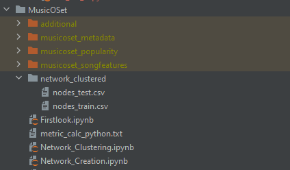

# Ba_first_tries

## Instruction:


- for the environment initialisation you can use the included yaml file (Ba_first_tries.yml)
- download MusicOSet through the following link: https://zenodo.org/records/4904639
  - the link can also be found in the paper "Collaboration-Aware Hit Song Prediction"
- make sure that you have the following dir Structure:



### Split Choice:

Throughout of the code you will come across code that looks like this:

```python
# border_day = combined_df["date"].iloc[-1]  - pd.DateOffset(years=6)
# combined_df = combined_df[(combined_df["date"] >= border_day)]
# 
# split_day = combined_df["date"].iloc[-1]  - pd.DateOffset(years=1)
# train_df = combined_df[(combined_df["date"]  < split_day)].copy()
# test_df = combined_df[(combined_df["date"]  >= split_day)].copy()
train_df, test_df = train_test_split(combined_df, test_size=0.25, shuffle=False)
```
 
This code gives you the option to choose your data split. If you want to have the full dataset use the bottom line. If you want a limited split enter your preferred number of years in the first DateOffset() function adn use the commented lines. 

Attention! 
You will need to change the splits in all other Notebooks and in the final prediction model as well!


### Dataset Preprocessing/Creation:

- now run Network_Creation.ipynb file
- now run the Network_Clustering.ipynb file
  - if you want to get the alternative structure of the collaboration graph run Network_Creation_v2.ipynb and change the input file in Preprocess_Data_baseline_simple_feature_calc.ipynb from nodes_test.csv to nodes_test_v2.csv

go to the Ba_first_tries/models/Original_MLP DIR.

- Now run Preprocess_Data_baseline_simple_feature_calc.ipynb
- then run Preprocess_calc_features.ipynb
- then run Compute_superstarvar.ipynb

The running of those notebooks should take a while. Especially for Compute Superstar.

Your final dataset should have the name data_superstar_v1_0.csv

### Model Execution:

The models are also located at the Ba_first_tries/models/Original_MLP DIR.

As mentioned before remember to choose your split before running the models.
The code for this purpose looks like this:

```python
#_train, X_test, y_train, y_test = train_test_split(X, y, test_size=0.25, shuffle=False)
split_day = X["date"].iloc[-1] - pd.DateOffset(years=1)
X_train = X[(X["date"] < split_day)].copy()
X_test = X[(X["date"] >= split_day)].copy()

sep_index = X_train.shape[0]
y_train = y.iloc[:sep_index].copy()
y_test = y.iloc[sep_index:].copy()
```

In this case you should not change the number of years. Instead choose the version that fits to your choice from the creation process of the dataset. (The choices should both be identical).

#### Further we will briefly explain the different models:

- MLP_best_comb.py is our final MLP model
- RandomForest_sklearn.py is the Random Forest Classifier
- MLP_song.py is the baseline sklearn model for HSP-song
- MLP_pagerank.py, MLP_artistid.py and MLP_collab.py are  the sklearn MLPs for the approaches
- MLP_superstar_comb.py is the class that runs all 2^8 combinations for the superstar variable (sklearn)
- MLP_pytorch_vx.py are the corresponding pytorch models
- MLP_pytorch_v3_comb is the class that runs all 2^4 combinations of the approaches for the pytorch model v3.
- MLP_pyt_tuning.py is the class that does the hyperparameter tuning for the pytorch v3 model.


The comb MLP classes produce a txt file for each version of the network. To facilitate evaluation we created eval classes for these.
Those eval classes are in the according directories to which the output of the corresponding MLP comb file is printed. 

#### Network Analysis:

The Feature importance analysis was done in RandomForestFeatimportance.ipynb and Network_Analysis.ipynb.
The Subdirectory output_pngs contains all by us created Graphs from the thesis.
